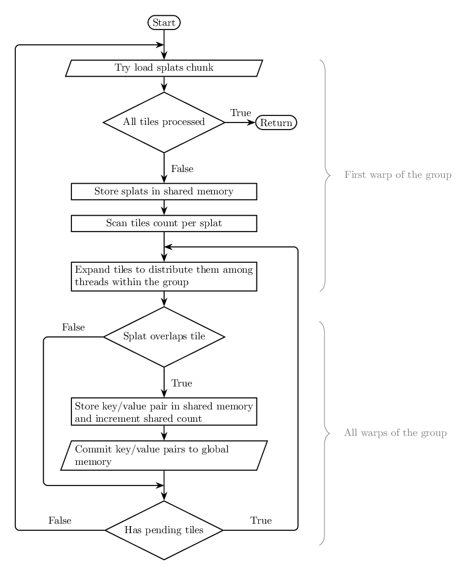

## Introduction
This project is an implementation of a Gaussian Splats Renderer, built from scratch using CUDA. The primary motivation is self study, a chance to explore both Gaussian Splats and advanced CUDA programming. It is mainly influenced by the following papers:

* "3D Gaussian Splatting for Real-Time Radiance Field Rendering" - Kerbl, Bernhard and Kopanas, Georgios and Leimkuhler, Thomas and Drettakis, George
* "EWA Splatting" - Matthias Zwicker, Hanspeter Pfister, Jeroen van Baar, and Markus Gross.

Testing splats data, including the one used for the generation of the illustrations of this document, is sourced from [GSOPs 2.5](https://github.com/cgnomads/GSOPs). No test data is included in the present repository.

The high level implementation is similar to the one developed by INRIA for its paper, however it is an alternative implementation built from scratch. I have deliberately chosen not to delve too much into INRIA's implementation, as I think it would've defeated the purpose of the process.

Similarly to INRIA's implementation, this is a volumetric renderer. As opposed to many viewers who fundamentally are alpha blended particle systems (each splat is a transparent quad).

*An animated capture of our system's output.*

## Overview
Splats are passed to the renderer as a collection of positions, covariance matrices, and colors. For each pixel, we traverse the list of splats overlapping the pixel, ordered by depth, and blend the color contribution of each splat according to the gaussian density at this pixel.

The renderer works with tiles of 16x16 pixels, for performance reasons. Tiles fit in shared memory, which is much faster than global memory. We must evaluate the screen space data corresponding to each splat, and gather the splats overlapping each tile, ordered by depth, front to back.

We recommend reading the section of the INRIA paper covering rasterization, for at a high level, our approach is very similar to theirs.

## Details
In this section we examine each step of the rendering process. The rendering of a frame follows the following steps, each of which is implemented as a CUDA kernel. (With the exception of radix sort, which requires multiple passes and is part of the `cub` NVIDIA library.)

* Set constant structs holding pointers to global memory and related sizes & capacities.
* Evaluate screen space data for each splat, including its projection, projected covariance matrix, and confidence ellipse.
* Build the list of tiles. It contains the screen tiles overlapped by each splat.
* Sort the list of tiles using radix sort.
* Evaluate the range corresponding to each tile in the sorted list.
* Rasterize each tile by traversing the list of splats overlapping it. This list is ordered by depth, front to back.

### Evaluate Splat Clip Data
For each splat, we evaluate screen space data, consumed by subsequent steps, based on world space data. This includes:

* The para-perspective projection matrix (the Jacobian projection in the EWA Splatting paper) derived from camera parameters and view space position. Each splat has its own affine projection matrix, allowing it to be projected on screen as an ellipse.
* The screen space ellipse whose principal axes are aligned with the projected splat. These axes are the eigen vectors of the projected covariance matrix. We can think of this ellipse as the splat's outline. It is the gaussian confidence ellipse. It is later used to test whether splats overlap with tiles.
* The inverse screen space covariance matrix, in 2 dimensions. It is later used to sample the gaussian density at a pixel during rasterization.

We recommend taking a look at the "EWA Splatting" paper for a rigorous examination of the mathematics involved.

*A capture of a Unity test project showing a comparison of standard perspective projection (pink) and para-perspective projection (cyan). Using para-perspective, the projected splat contour on screen is an ellipse, which simplifies subsequent calculations. We notice that towards the edges and front of the frustum, differences become more noticeable. However when working with large quantities of small splats, this becomes irrelevant.*

*Visualization of the affine projection of a splat within the frustum of the corresponding perspective projection.*

### Build Tile List
We subdivide the screen in 16x16 tiles. Such tiles fit in shared memory, which is much faster than global memory. We need to determine the list of tiles overlapped by each splat.

The heart of the kernel is each thread of the group performing an ellipse/rectangle overlap test. The ellipse corresponds to the outline of a splat, the rectangle corresponds to the bounds of a tile. (Note: some implementations use oriented rectangular bounding boxes for splats. This leads to more tiles covered by splats.) If there is an overlap, the splat is added to the list of splats to traverse for the rasterization of this tile. We need to distribute the workload among the group's threads. The first warp loads a chunk of splats, and for each of them, evaluates an axis aligned bounding rectangle in tiles space. Each thread evaluates the number of tiles requiring an overlap test for the splat they have loaded. These tile counts are scanned within the warp. We can then proceed to workload distribution. Each thread within the warp writes the index of the splat it loaded over a section of a shared buffer. Each slot within this shared buffer corresponds to a thread in the group. It is likely that we have more tiles to process than threads in the group, in which case we execute multiple passes until all tiles are processed. We then go back to the loading stage, where the first warp attempts to load another chunk of splats.

Whenever a thread determines that the tile it's responsible for overlaps the splat it was allocated, it writes a key/value pair to shared memory and bumps the count of pairs to be added to the global tile list. Using shared memory to gather data allows us to then commit to global memory with coalesced writes.

Only the first warp handles the loading of splats and the workload distribution. that's because each splat covers multiple tiles. Loading fewer splats than threads in the group still generates enough work to occupy the whole group. We can then limit ourselves to warp level synchronization. We also observed that expanding loading beyond the first warp can exhaust shared memory.

Our implementation uses persistent groups. All groups run continuously until the list of splats to process is exhausted and the grid exits. The number of groups in the grid depends on the number of streaming multiprocessors on the GPU (times a constant so that schedulers have work to pick when a group is stalled by memory transactions). We have determined that it is a bit fater than dispatching one group per chunk of splats.

The tile list is a list of key/value pairs. Values are splat indices, keys are composed of the tile index and the clip space depth of the splat. Our projection is such that depth is linear in clip space, as would be the case with an orthographic projection. Keys are encoded in 64 bits, the lower 32 bits are used to encode depth, the upper 32 bits are used to encode the tile index. Therefore, once the list is sorted, all pairs corresponding to a given tile are contiguous, and within this contiguous section, pairs are ordered according to depth. This ordering allows us to traverse splats from front to back for each tile during the final rasterization stage.

### Sort Tile List
As in the 3D Gaussian Splatting paper implementation, the `cub` library is used to sort the tile list (`cub::DeviceRadixSort::SortPairs`). In our implementation we have hardcoded screen dimensions, so we know that we need 12 bits to encode tile indices. It lets us limit the number of bits that radix sort needs to handle. A similar optimization could easily be implemented with dynamic resolution, the number of bits necessary to encode tile indices being easily determined at runtime.

### Evaluate Tile Range
For rasterization, we need to determine the beginning and end of each tile's section within the tile list. We have mentioned that after sorting, the data for each tile is contiguous and ordered by depth. Evaluating ranges is simple: compare each pair of contiguous keys within the tile list, if the tile index changes, we know that we have identified the end of a tile's range and the beginning of the next. There are special cases: the beginning of the first range and the end of the last. These are handled by the first thread of the grid.

### Rasterize Tile
Rasterization is the last step. For each tile, the list of overlapping splats is traversed from from front to back, and color contributions are blended together. Each group of the grid is responsible for one tile, to take advantage of shared memory. Each thread within the group is responsible for one pixel within the tile. For each splat, opacity is inferred from the gaussian density at the pixel's position. Splats are loaded 32 at a time by the first warp of the group. Traversal is interrupted if the tile is opaque enough after the rasterization of the current chunk. Finally the tile is copied from shared memory to global texture memory. One noteworthy constraint here is that splats data memory accesses (read) are not coalesced, leading to wasted memory bandwidth. This is due to the tile list containing splat indices, not their data. The splats overlapping a tile are not contiguous in global memory.

## Implementation Notes

Arguments to the kernels are uploaded as constant struct, they need to be uploaded at most once per frame. The only exception is the tile list pointers and capacity, which need multiple updates over the frame, and are stored in a separate structure. We generally store data using built in CUDA types (`float4`, `float2`, ...), then convert to `glm` types (`glm::vec4`, `glm::vec2`, ...) for computations within the kernels. This allows us to take advantage of CUDA specific optimizations when manipulating built in types.

* **Demo.cpp**: The application itself, which follows a classic setup, update loop and cleanup pattern. All rendering is done with CUDA, except for the display of the rendered texture on screen, which is done with OpenGL. The gaussian splats can either be loaded from a ply file (the path is passed as a command line argument), or procedurally generated. The latter being useful for testing.
* **Utilities**: A set of helper classes to manage OpenGL buffers and their interoperability with CUDA, as well as a CUDA timer class for profiling. These simple RAII classes are helpful to simplify and strengthen the demo code.
* **DeviceBuffer**: a simple RAII struct responsible for managing CUDA buffers.
* **PlyLoader**: a simple .ply parser used to load datasets. It is as simple as possible given the expected structure of gaussian splats .ply files. It is not a generic ply file parser.
* **GaussianRender.cuh**: header file for the CUDA rendering code, includes the interface of the various rendering steps, and a set of simple structs either pertaining to the exchange of global data or geometric operations.
* **GaussianRender.cu**: the most important file. It contains all CUDA kernels, and their helper functions. 

## Limitations And Future Work

So far, for simplicity reasons, the rendering resolution is hardcoded.
The existing rendering stages have been profiled and optimized. However, going beyond the scope of this project, performance could be improved by introducing hierarchical spatial acceleration structures to store splats.

Performance varies depending on the camera view. In this demo we use an orbiting camera controller that accounts for the overall bounding box of the set of splats. It is more suitable for objects than environments (the latter would rather call for a free flying camera). There is a roughly linear relationship between global performance and the size of the tile list. The confidence ellipse outlining a projected splat is scaled based on the "3-sigma rule". However in practice it seems that we could go below this threshold with little noticeable visual degradation, to improve performance. Ultimately, we're facing the problem of gaussian kernels having infinite support.

*Visualization of the tiles corresponding to the splats. Note the limited visual contribution of the outer tiles.*

As an alternative to Gaussian kernel, who have infinite support, we tried using Epanechnikov kernels. These have finite support. As expected, we notice that using Epanechnikov kernels speeds up rendering. (See "Don't Splat your Gaussians: Volumetric Ray-Traced Primitives for Modeling and Rendering Scattering and Emissive Media", by  Jorge Condor et al.)

| Kernel | Gaussian | Epanechnikov |
| -------- | -------- | -------- |
| Screenshot |  |  | 
| Render Time | 10.302821ms | 8.836210ms |

Generally, the costliest kernels are the ones building the tile list, sorting it, and final rasterization. This last kernel does suffer from non coalesced memory reads, since the splats overlapping a given tile are not contiguous in global memory. INRIA's implementation tries to improve cache usage by sorting the loaded splats according to Morton order. We tried something similar but the improvement seemed too minimal to be kept in the code. It may be worth trying Hilbert ordering.  

## Profiling

All development, testing and profiling was done on a Dell laptop, featuring an NVIDIA GeForce RTX 3050 GPU, and an Intel i7 (12th gen) processor. We profile each kernel then calculate the total CUDA execution time per frame. Note that performance is affected by the number of splats per scene, but also by the point of view of the camera: the closest a splat is to the camera, the more tiles it overlaps. The furthest we are, the more a tile may overlap with a large number of splats. The latter could be addressed by using a hierarchical data structure, which is beyond the scope of this project. Note that we focus on CUDA kernels since the splats are uploaded to the GPU on startup and the display of the rendered texture on screen using OpenGL is a trivial operation.

| | Lilly Boquet | Van Gogh Room | Christmas Tree |
| -------- | -------- | -------- | -------- | 
| Number Of Splats | 815957 | 341294 | 149621 | 
| Thumbnail |  |  |  |
| Evaluate Clip Data | 0.475747ms | 0.209424ms | 0.144870ms |
| Build Tile List | 1.100223ms | 0.651864ms | 0.513808ms |
| Sort Tile List | 6.020900ms | 1.300160ms | 0.871186ms |
| Evaluate Tile Ranges | 0.149122ms | 0.074850ms | 0.054080ms |
| Render Depth Buffer | 4.756582ms | 2.559919ms | 2.397438ms |
| Total | 12.502574ms | 4.796218ms | 3.981381ms |

## Attributions For The Test Data

*Van Gogh Room*

_https://poly.cam/tools/gaussian-splatting?capture=7d649e50-a6f9-4a18-87c5-d69930b44afd
https://poly.cam/@headsketch
https://www.headsketch.xyz/polycam_

*Lilly Boquet*

_Not for commercial use!
Provided courtesy of David Lisser: https://davidlisser.co.uk/.
Spherical harmonics (f_rest\_*) attributes not included due to GitHub file size limits._